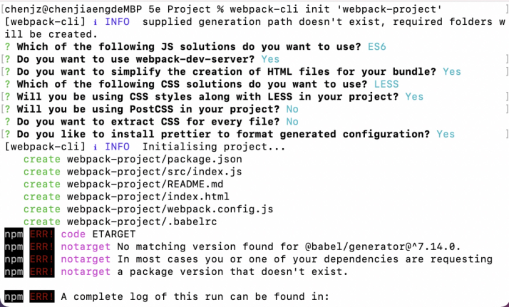
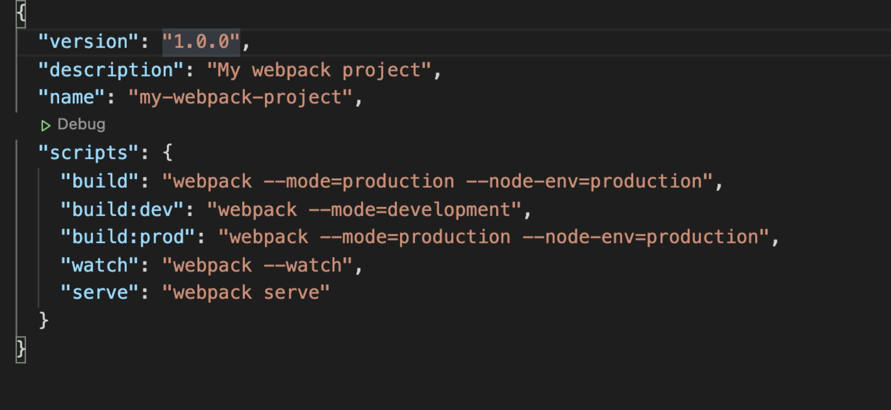
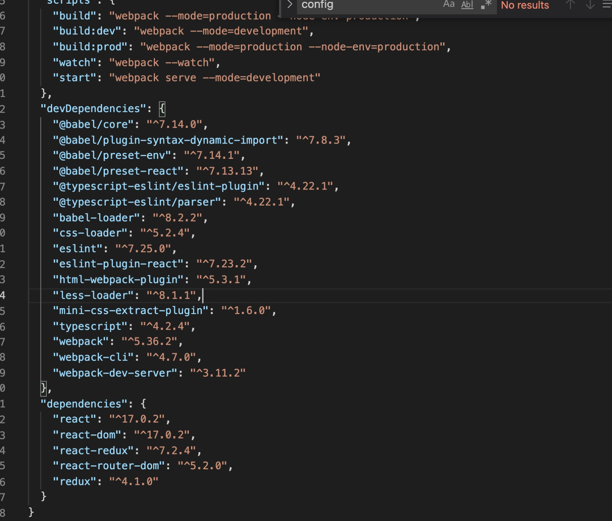
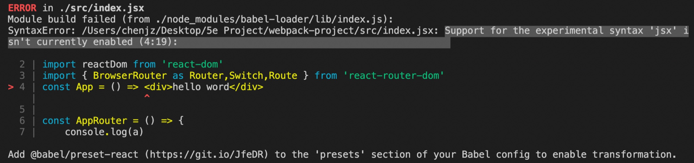
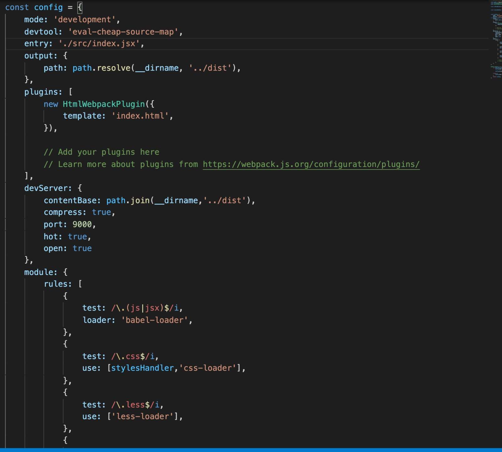
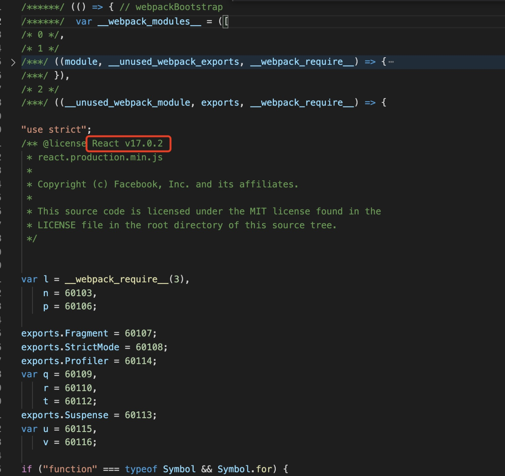
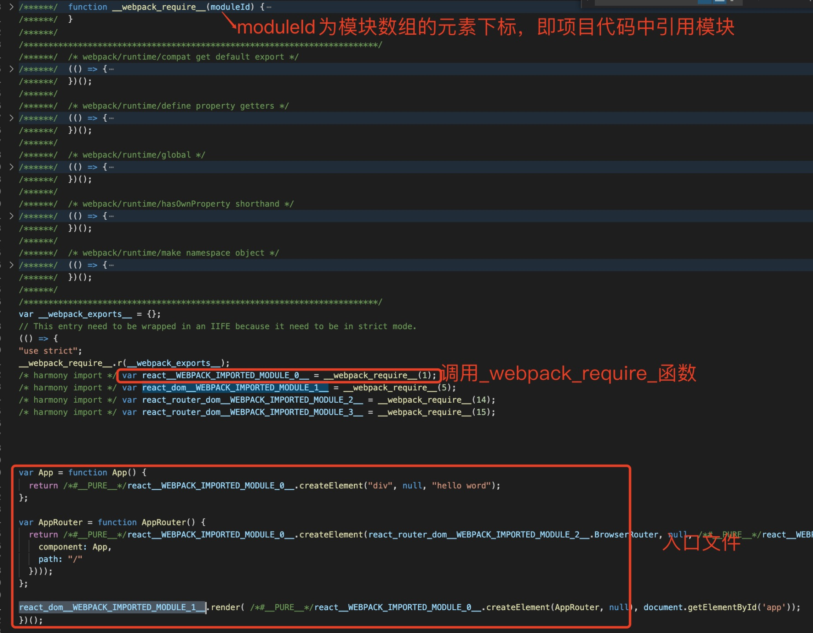

# webpack学习 - 搭建项目  
学习webpack的过程中使用webpack和webpack-cli搭建了一个react+redux+typescrip项目，在这个过程中遇到的一些问题让我对webpack有了更深的了解。
## 搭建过程  
在使用webpack搭建项目之前，首先我们得在全局安装webpack和webpack-cli。使用webpack-cli init之前也需要全局安装@webpack-cli/generators。安装完成之后在终端运行webpack-cli init ‘期待路径/项目名称’或者终端先进入期待文件下再webpack-cli init ‘项目名称’。  
    
底下的报错是因为没有指定package.json的版本号、项目名称和项目描述，webpack-cli会设置默认值。  
   
我们也可以通过在目标文件下新建项目文件夹，再yarn init初始化package.json设置版本号、项目名称和项目描述，生成node-modules，再webpack-cli init进行初始化项目避免这个问题。  
因为webpack只能理解javascript和json文件且为了让代码能够运行在当前和旧版本的浏览器或其他环境中，所以需要各种loader加载器以及各种babel插件。同时为了让webpack更加强大、灵活，webpack通过plugin的方式允许开发者自定义插件或者使用社区上各种插件，在webpack提供的钩子机制上开发者几乎能干预webpack每个环节，通过往这些不同节点上挂载不同的任务从而实现预期的打包结果。而初始化的项目未支持react、reactDom、router、redux、typescript和各种plugin、loader加载器，所以我们需要把这些依赖安装到我们项目的node_modules上，同时为了避免项目上的webpack和本地全局的webpack版本不一致可能导致的问题，我们需要局部yarn add webpack和webpack-cli。  
在安装项目依赖时，直接yarn add或者yarn add xxx -S会生成依赖包名称和对应的版本号在dependencies对象，而yarn add xxx -D会生成依赖包名称和对应的版本号在devDependencies对象。它们的区别是devDependencies只会在开发环境下依赖的模块，生产环境不会被打入包内。通过NODE_ENV=development或NODE_ENV=production指定开发还是生产环境。 而dependencies依赖的包不仅开发环境能使用，生产环境也能使用。以下就是我们安装到node_modules的各种plugin、loader、babel相关插件。  
    
当我们把依赖都安装好之后webpack serve运行项目时,发现构建失败，报错指向./node_modules/babel-loader/lib/index.js，Cannot find module '@babel/core'，所以根据提示依次安装所需要的依赖。根据报错安装完所有依赖后再运行项目，发现还是构建失败，失败错误是未启动对jsx语法的支持。  
  
这是因为babelrc文件的缺少@babel/preset/react的预设，所以无法对jsx语法转译成React.createElement()。在presets数组上加上@babel/preset/react再运行就能把我们的项目运行起来了。我们也可以新建babel的配置文件，而且babel.config.js优先级比babelrc高。babelrc的加载规则是按目录加载的，是只针对自己的代码，而babel.config.js会影响整个项目中的代码，包含node_modules中的代码。  
配置完项目的开发环境成功运行后，解析一下webpack.config.js文件以及build打包后的代码。  
   
mode配置有3种：development、production、none。其中mode: ‘development’相当于默认配置devtool: 'eval' …等配置。但是devtool: ‘eval’虽然打包迅速，但是项目代码发生报错时不能定位到源代码中，只能定位到打包后的代码上。所以我们在开发环境上需要自定义devtool指定source-map(经过多次实验开发环境最佳方案是eval-cheap-module-source-map，打包速度还可以且报错能定位到源码。根据官网文档和多次实验的打包结果，我个人的判断是因为webpack源码根据eval、cheap、module、inline关键字判断做对应的打包逻辑和代码映射逻辑，其中module参数就是增加对 loader source map 和第三方模块的映射)。  
## 接下来解析一下使webpack变得强大和灵活的plugins和loader。 
* plugins  
webpack的社区已经有了丰富的plugin资源满足我们大部分的开发、优化的需求，例如我们常见的html-webpack-plugin和mini-css-extract-plugin，其中html-webpack-plugin的作用就是生成用于发布的index.html文件和自动更新我们每次打包出来的文件，index文件里面的script标签中src属性就是打包后的文件，通过minify属性配置压缩选项值的hash:true还可以生成带有哈希值的文件名，其中还有inject配置插入的script插入的位置和favicon-为生成的html文件生成一个favicon等属性。而mini-css-extract-plugin的作用就是优化、压缩css。  
* loader  
Webpack 实现不同种类资源模块加载的核心就是 loader，因为webpack 只能理解 JavaScript 和 JSON 文件，loader 让 webpack 能够去处理其他类型的文件，并将它们转换为有效 模块，即webpack能够理解的文件。  
loader 有三个属常用性：  
    * test 属性，识别出哪些文件会被转换。  
    * use 属性，定义出在进行转换时，应该使用哪个 loader。  
    * include属性， loader应用在目标路径文件下。  
通过使用 include 字段，将 loader 应用在实际需要将其转换的模块能提高打包的性能。  
## 关于打包性能优化  
1. node.js和yarn更新至最新版本，较新的版本能够更高效建立模块树和提高解析速度  
2. 在module.rule中通过使用 include 字段，将 loader 应用在实际需要将其转换的模块  
3. 减少编译结果的整体大小，通过tree shaking - 把无用代码“摇”掉,减少对未引用的依赖文件打包，压缩打包的体积；code splitting - 分块打包；splitChunks - 公共代码块提取；在多页面应用程序中使用 SplitChunksPlugin ，并开启 async 模式。  
    tree shaking的实现用到了webpack两个优化功能：usedExports - 打包结果只导出外部引用的成员（标记未引用的依赖）;minimize-压缩打包结果（过滤未引用的依赖）。Tree shaking 只能移除没有用到的代码成员，而想要完整移除没有用到的模块，那就需要开启 sideEffects 特性。  
    Code splitting的作用是把打包的结果按照一定的规则分离到多个 bundle 中，然后根据应用的运行需要按需加载。实现分包的方式主要有两种：  
    1. 根据业务不同，配置多个打包入口，输出多个打包结果—适用于多页面程序，需要通过 HtmlWebpackPlugin 的 chunks 属性来设置指定所使用的 bundle。  
    2. 结合 ES Modules 的动态导入特性，按需加载模块。由于我们选定的框架是react,react动态加载方式：React.lazy() 允许你定义一个动态加载的组件。这有助于缩减 bundle 的体积，并延迟加载在初次渲染时未用到的组件。  
   
    提取公共模块 — optimization.splitChunks.chunks: all - 自动提取所有公共模块到单独 bundle     
    当项目mode: ‘production’时，webpack默认启用tree shaking功能和启用concatenateModules将输出结果的多个模块函数（如果是多模块打包）合并到一起输出一个立即执行函数，通过还启用NamedChunksPlugin 和 NamedModulesPlugin插件。  
’production’和’development’这两个环境下的构建目标存在着巨大差异，所以webpack配置也存在着差异。为了更好的区分’production’和’development’的webpack配置，通常需要分别定义开发环境、生产环境配置还有通用配置，通过webpack-merge 的工具将这些配置合并组成对应环境的wbepack配置。  
## 从打包结果思考webpack的打包思维和原理   
把mode设置为none，通过观察最原始方式的打包文件我们能发现main.js是一个立即执行函数。立即执行函数内部声明了__webpack_modules__=[],数组内部均是参数列表相同的函数，这里的函数对应的就是我们源代码中的模块，也就是说每个模块最终被包裹到了这样一个函数中，从而实现模块私有作用域。下图就是react打包后的函数。  
 
把模块数组折叠起来，在立即执行函数中间是一些工具函数，最下面是webapck的入口文件的代码，在入口文件使用import进来的模块内容就是模块数组对应下标的模块。  

