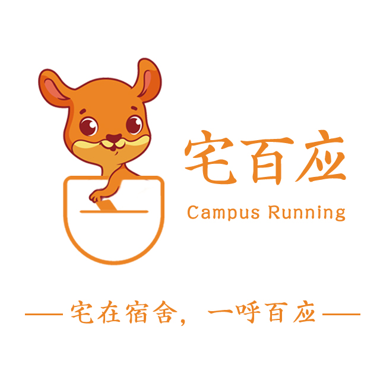

蛋不是哺乳动物的产物，怎么会在腹中呢？嗯...。

看标题就知道这是一个完蛋蛋的初创项目，失败产物有什么好说的呢？嗯...。

它叫“宅百应” - 我曾自豪的对外宣传 - 宅在宿舍，一呼百应，同时也靠这个口号以及我的想法打动了4个和我有着同样的梦的同学，我们曾一起孵化这个“蛋”，但是因为种种原因还是走向了失败。

## 想法的诞生

还记得那是大三的平平无奇的一天，在日常生活（特别是大学生活）中好像顺路带点什么这件事情每天都在大量发生 - “顺路帮我带个饭”、“顺路帮我缴个水电费”、“顺路帮我买些。。”等等等等，这种现象在女生宿舍更是司空常见，当时我就在想如果把这种消费人与人情感的顺路行为变成需要利益驱动的交易行为，会不会大受青睐。基于这个“懒人经济”以及我对校园及周边环境的了解，我开始针对这个模式展开了思考，最后决定做一个顺路跑腿的网站，核心功能就是跑腿人员审核 - 表单（学生信息包括宿舍定位坐标）提交到后台人工审核；获取当前位置周边订单（如果订单发起人完善过自身信息和宿舍所属定位，会优先排序离跑腿人员宿舍近的订单，毕竟核心理念是顺路嘛）,通过这个网站把用户引流到公众号上，把公众号做成高校服务号，通过流量变现（当时只想到广告费一种变现方式），有流量后期做其他服务也很容易。通过这个想法我说服了4位同学，一个前端，一个后台，两个妹子做测试、产品和文档，而我自己则是半个前端、半个UI、半个产品。在和他们的交谈中，我曾口出狂言说目前我们要做的东西仅仅以本校做为试点，经过试点优化后我们会推广到广州所有大学，最后推广到整个广东省甚至全国大学，我也强调美团对跑腿业务的布局，将来我们会成为美团的竞争对手与他们抢占市场（这饼画的）。当时我选了和美团吉祥物一样的袋鼠作为我们的吉祥物，并且设计了一个logo。

 

## 孵化过程
在这个故事背景下，我们正式开始了我们的工作。但是激情往往容易退去，没有物质的团队是一盘散沙，再加上两位男同学还有其他工作室，其中一个女生是班干部（因此后来我们的项目还被班主任知道了，班主任还要做我们的指导老师，并且帮我们报名学校的创业大赛），平时学校课程也不少，所以导致团队状态疲软，团队成员工作状态低迷低效，连兼职都不算，更不要说全身心投入了。在报名创业大赛之后（只需要上交项目文档），我们又一起针对这个项目的前景展开了一个分析会，自那以后团队成员的状态回升了一些，特别是比赛通过了初赛，拿到了200大元以后。同时历经两个多月由一群不专业的人打造的一个满是bug的基础产品终于开发完成，同时复赛落选的消息也传了过来（原因应该是通过广告费这种变现方式的问题，应该专注流量和数据，往投资这方向展开），此时已经临近暑假了，我想着不能再拖下去了，第一版需要投入市场试用，产品打磨优化同时进行，不然回到最初的状态项目又推不动了，让他们每个阶段有事可干，美曰一个产品从想法到准备，再到开发、落地、推广这个经历对我们将来的实习有着很大的帮助...哔哩巴巴。于是，我们在一边憧憬着美好未来，一边微微颤颤的举行了第一次线下推广活动...

## 走向失败
线下推广的效果不尽人意，产品知名度低 - 由于扫码领取微信卡包优惠券的功能因技术原因完成不了以及使用过程不友好和bug问题，导致推广效果一般，而且优惠力度不足（几乎没有）和应用可玩性低导致用户粘性不足，结果就是引流用户少，申请成为顺路跑腿的人少，有时候因无人接单我们需要接单完成服务。这一系列负面反馈使得团队人心涣散，又加上临近期末，所以就先放下优化工作，准备迎接期末考试。当时我计划暑假放假后，在学校附近租房，一起封闭式开发把产品打磨好，待新生开学之时把产品推广出去，到时候...（浮想联翩)。但是计划赶不上变化，当期末考试结束我说出了这个计划后，后台和一位女生也说出了找到实习的事实，另外两个也表示出了不想坚持的意愿，打算暑假也去找实习工作。这一连串的打击彷佛在我头上浇了一盘冷水，这感觉就好像在爱情中我在筹备着未来，而你却想着离开，最终我也释怀了，毕竟我现在给予不了任何东西给他们，为了一份不确定的未来浪费时间，他们能坚持到现在已经仁慈义尽了。最终，我们团队在完成了一系列收尾工作后（跑了几趟工商局都注销不了公司，最后花钱把公司转让给别人）在烧烤档正式宣布解散。

回想这次失败的经历，我认真思考了下失败的点，我觉得主要的原因有
* 不够专业的人
* 没有糖 - 积极性调动不起来
* 兼职 - 没有充分投入的状态和时间
* 缺少懂运营的人才
  
总的来说最主要的原因就是没有钱。虽然最终我们是失败了，但是我们都是在可承受范围内试错，不过回想当初的我们为了一个想法而满怀激情的样子还是挺酷的，respect。

